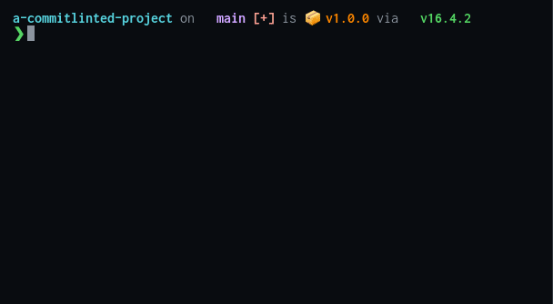

<h1 align="center"> Commit Editor</h1>

<p align="center">Interactive commitlint support to boost your conventional commits and semantic release productivity</p>

<p align="center">
    <a href="https://commit-editor.netlify.app"></a>
    <a href="https://www.npmjs.com/package/commit-editor"></a>
    <a href="https://github.com/wtho/commit-editor/actions/workflows/deploy.yml"></a>
    <a href="https://coveralls.io/github/wtho/commit-editor?branch=main"></a>
    <a href="https://github.com/wtho/commit-editor/blob/main/LICENSE"></a>
</p>

<p align="center">
    <b>powered by <a href="https://commitlint.js.org/">Commitlint</a>, <a href="https://microsoft.github.io/monaco-editor/">Monaco-Editor</a>, <a href="https://v3.vuejs.org/">Vue3</a> & <a href="https://vitejs.dev/">Vite</a></b>
</p>

## Getting started

You can use it to commit in your codebase using the _commit-editor_ by running

```bash
npx commit-editor
```

from where you would run `git commit`.
The command then calls `git commit` internally, only modifying the editor used in the command to open the _commit-editor_ in your browser, served by a lightweight local server.

You can even append options like `npx commit-editor --amend`, they get passed through to `git commit`.

_Commit-editor_ will load the Commitlint config from `commitlint.config.js` (or `commitlint.config.ts`) or , if no config is found, use a basic config with the `@commitlint/config-conventional` preset.

Alternatively you can test out and tinker with your commitlint config using the [playground served at netlify](https://commit-editor.netlify.app).

To use _commit-editor_ as your all-time editor, set the editor as your default using `git conig --global core.editor="npx commit-editor"`

## Motivation

While the benefits of the combination of conventional commits, conventional changelog and semantic release are immense, the experience of existing post-compose commit validation tools can be frustrating.
Feedback is supplied very late and the message lost if it does not pass the validation.
This is specifically frustrating for semantic-release novices.

This editor tackles this issue by providing commit lint information during the composing process, like we are used to it when writing our code.

Post-compose commit validation can still be applied after the message composing.

### Experience with post-compose commit validation
<p align="center">
  
</p>

### Experience with _commit-editor_
Give it a [try in the playground](https://commit-editor.netlify.app).

